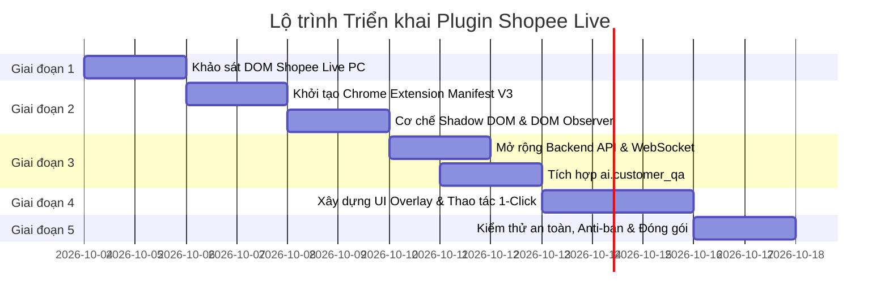

# Kế hoạch Phát triển Plugin Overlay AI Hỗ trợ Livestream Shopee

Tài liệu này mô tả chi tiết kiến trúc kỹ thuật, luồng dữ liệu, cơ chế tương tác và kế hoạch triển khai từng bước cho giải pháp **Plugin Overlay hỗ trợ người bán hàng trên Shopee Live** (Chrome Extension Manifest V3 kết hợp AI Backend).

---

## 1. Tổng quan & Mục tiêu

### 1.1. Bối cảnh
Người bán hàng (streamer/shop owner) khi phát trực tiếp trên Shopee Live Web (cổng Shopee Live PC / Shopee Creator) phải liên tục xử lý luồng bình luận đổ về rất nhanh:
- Người xem hỏi lặp đi lặp lại về: giá, kích cỡ (size chart), chất liệu, màu sắc, tồn kho, mã giảm giá, phí ship.
- Streamer vừa phải giới thiệu sản phẩm trước ống kính, vừa phải đọc chat và gõ phím trả lời, dễ bị trôi tin nhắn và bỏ lỡ cơ hội chốt đơn.
- Các yêu cầu nhạy cảm (khiếu nại, đòi hoàn tiền, trả giá bất thường) cần phát hiện kịp thời để xử lý khéo léo.

### 1.2. Mục tiêu sản phẩm
Phát triển một **Browser Extension (Chrome/Edge/Cốc Cốc)** nhúng trực tiếp giao diện tiện ích thông minh (**Overlay**) ngay cạnh/đè lên khung chat của Shopee Live PC:
1. **Lắng nghe và lọc bình luận thời gian thực**: Tự động nhận diện đâu là câu hỏi của khách hàng, loại bỏ tin nhắn spam, icon, thả tim.
2. **AI Sinh câu trả lời chuẩn xác**: Dựa vào danh mục sản phẩm (đặc biệt là sản phẩm đang được ghim trên live) và chính sách của shop để tạo câu trả lời mẫu có căn cứ.
3. **Tương tác 1 chạm (1-Click Action)**: Người bán chỉ cần 1 cú click chuột hoặc phím tắt để điền câu trả lời vào ô chat của Shopee và gửi đi.
4. **Nhắc thoại (Streamer Teleprompter)**: Tóm tắt thông tin ngắn gọn để streamer nhìn vào nói trực tiếp mà không cần bấm phím.
5. **An toàn & Kiểm soát (Human-in-the-loop)**: Không tự động gửi bừa bãi; các trường hợp nhạy cảm được chuyển sang trạng thái cảnh báo người vận hành.

---

## 2. Kiến trúc Hệ thống

### 2.1. Sơ đồ khối tổng thể

```mermaid
flowchart TB
    subgraph BrowserContext ["Trình duyệt người bán (Chrome / Edge)"]
        subgraph ShopeePage ["Trang Shopee Live PC Web"]
            ShopeeChatList["Khung danh sách Chat"]
            ShopeeInput["Ô nhập tin nhắn & Nút gửi"]
        end

        subgraph ExtensionApp ["Chrome Extension (Manifest V3)"]
            ChatObserver["Chat Observer / Interceptor"]
            ShadowContainer["Shadow DOM Container (#ai-overlay-root)"]
            OverlayUI["Giao diện Overlay (React / Tailwind)"]
            ChatInjector["Action & Chat Injector"]
            ContentBridge["Content Script Bridge"]
            BackgroundWorker["Service Worker (Background)"]
        end
    end

    subgraph BackendServer ["Hệ thống AI Agent Backend"]
        FastAPIServer["FastAPI Server (REST & WebSocket)"]
        SessionContext["Live Session Context Manager\n(Pinned Product, Pinned Voucher)"]
        AICustomerQA["ai.customer_qa\n(Intent, Safety, RAG & Answer)"]
        AIOperations["ai.operations\n(Classifier, Aggregator)"]
        AIData["ai.data\n(Catalog, FAQ, Policies)"]
    end

    ShopeeChatList -->|1. Tin nhắn mới (DOM / WS)| ChatObserver
    ChatObserver -->|2. Comment Object| ContentBridge
    ContentBridge <-->|3. Message Passing| BackgroundWorker
    BackgroundWorker <-->|4. WebSocket / HTTP| FastAPIServer

    FastAPIServer <--> SessionContext
    FastAPIServer <--> AICustomerQA
    AICustomerQA <--> AIData
    FastAPIServer <--> AIOperations

    FastAPIServer -->|5. Gợi ý trả lời + Trích dẫn nguồn| BackgroundWorker
    BackgroundWorker -->|6. Render kết quả| OverlayUI
    OverlayUI -->|Gắn vào| ShadowContainer
    ShadowContainer -.->|Hiển thị đè lên/cạnh| ShopeeChatList

    OverlayUI -->|7. Streamer bấm 'Gửi' / Phím tắt| ChatInjector
    ChatInjector -->|8. Dispatch Input/Change/Click Event| ShopeeInput
```

### 2.2. Thành phần kỹ thuật chính

| Thành phần | Công nghệ / Kỹ thuật | Trách nhiệm |
| :--- | :--- | :--- |
| **Shadow DOM Overlay** | Web Components (`attachShadow({mode: 'closed'})`) | Cách ly 100% CSS với trang Shopee. Đảm bảo giao diện hiện đại, không bị Shopee làm vỡ layout và ngược lại. |
| **Chat Observer** | `MutationObserver` + Web-accessible WS Hook | Bắt ngay lập tức khi có thẻ comment mới xuất hiện trong khung chat Shopee Live. |
| **Chat Injector** | Native DOM Event Simulation (`input`, `change`, `keydown`) | Tự động điền text vào textarea/input của Shopee và kích hoạt sự kiện gửi an toàn, tự nhiên. |
| **Extension Core** | Chrome Extension Manifest V3 | Quản lý vòng đời, phân quyền URL (`*://live.shopee.vn/*`, `*://creator.shopee.vn/*`), lưu cấu hình local (`chrome.storage.local`). |
| **Backend API** | FastAPI + WebSockets | Tiếp nhận luồng comment, duy trì kết nối real-time, quản lý sản phẩm đang ghim trên live. |
| **AI Intelligence** | `ai.customer_qa`, `ai.data`, `ai.operations` | Phân loại ý định, kiểm tra an toàn (chống injection, lọc khiếu nại), tìm kiếm RAG và sinh câu trả lời kèm source ID. |

---

## 3. Cơ chế Hoạt động Chi tiết

### 3.1. Cơ chế bóc tách bình luận (DOM Observer vs Network Interceptor)
Có 2 lớp phòng thủ để lấy bình luận từ Shopee Live:
1. **Lớp 1: DOM MutationObserver (Ưu tiên)**:
   - Quan sát phần tử chứa danh sách tin nhắn (`.chat-scroll-container` hoặc container tương đương).
   - Bóc tách:
     ```javascript
     {
       comment_id: element.getAttribute('data-msg-id') || hash(username + text + timestamp),
       sender_name: element.querySelector('.sender-name')?.innerText?.trim(),
       content: element.querySelector('.message-text')?.innerText?.trim(),
       timestamp: Date.now()
     }
     ```
2. **Lớp 2: Network / WebSocket Snooping (Bổ trợ)**:
   - Shopee Live truyền tin nhắn realtime qua kết nối WebSocket (`wss://`).
   - Sử dụng một inject script ở `MAIN` world để hook `window.WebSocket.prototype.send` và `onmessage` để bắt tin nhắn gốc dạng JSON nếu Shopee mã hóa hoặc thay đổi class CSS giao diện.

### 3.2. Cơ chế điền và gửi tin nhắn (Chat Injection)
Shopee Live PC dùng React/Vue. Việc gán giá trị thuần `input.value = "..."` sẽ **không** kích hoạt React State. Do đó cần dùng cơ chế native descriptor:
```javascript
function fillAndSendShopeeChat(inputElement, sendButton, text) {
  // 1. Focus ô nhập liệu
  inputElement.focus();

  // 2. Kích hoạt native setter của HTMLInputElement/HTMLTextAreaElement
  const nativeInputValueSetter = Object.getOwnPropertyDescriptor(
    window.HTMLTextAreaElement.prototype,
    "value"
  )?.set || Object.getOwnPropertyDescriptor(
    window.HTMLInputElement.prototype,
    "value"
  )?.set;

  if (nativeInputValueSetter) {
    nativeInputValueSetter.call(inputElement, text);
  } else {
    inputElement.value = text;
  }

  // 3. Dispatch các event để React nhận biết thay đổi state
  inputElement.dispatchEvent(new Event('input', { bubbles: true }));
  inputElement.dispatchEvent(new Event('change', { bubbles: true }));

  // 4. Kích hoạt nút gửi hoặc phím Enter
  setTimeout(() => {
    if (sendButton && !sendButton.disabled) {
      sendButton.click();
    } else {
      inputElement.dispatchEvent(new KeyboardEvent('keydown', {
        key: 'Enter',
        code: 'Enter',
        keyCode: 13,
        which: 13,
        bubbles: true
      }));
    }
  }, 100);
}
```

### 3.3. Tích hợp AI Engine (`ai.customer_qa`)
Khi có câu hỏi mới, Extension gửi payload về Backend:
```json
{
  "session_id": "shopee-live-2026-10-03-session-01",
  "comment_id": "cmt-9921",
  "sender": "hoang_yen_95",
  "text": "Áo polo trắng này form rộng không shop, 60kg mặc size gì?",
  "pinned_product_id": "PROD-POLO-01"
}
```
Backend xử lý qua chuỗi:
1. `classify_intent(text)`: Trả về `product_information` hoặc `stock_question`.
2. Kiểm tra an toàn `safety.py`: Không phải injection, không phải khiếu nại nghiêm trọng.
3. `retrieve_evidence()`: Tìm bảng size, thông tin sản phẩm `PROD-POLO-01`.
4. `draft_customer_answer()`: Trả về câu trả lời nháp:
   - *Status*: `answered`
   - *Answer*: *"Dạ áo polo form Regular rộng rãi thoải mái ạ! Bạn 60kg chọn size L là mặc vừa vặn tôn dáng nhé ạ."*
   - *Sources*: `[{"source_type": "product", "source_id": "PROD-POLO-01", "title": "Bảng quy đổi kích cỡ"}]`
   - *Needs Human Review*: `false`

---

## 4. Thiết kế Giao diện Overlay (UI/UX)

Giao diện Overlay được thiết kế hiện đại, tinh gọn để không cản trở streamer:

```text
+-------------------------------------------------------------------+
|  🤖 SHOPEE LIVE AI COPILOT                     [⚙] [-] [✖]        |
+-------------------------------------------------------------------+
|  📌 Đang ghim: Áo Polo Classic [PROD-POLO-01] | Kho: 24 | Giảm 15k|
+-------------------------------------------------------------------+
|  [Tất cả (124)]  |  [⚡ Cần trả lời (3)]  |  [⚠️ Chờ duyệt (1)]     |
+-------------------------------------------------------------------+
|                                                                   |
|  💬 @hoang_yen_95: "60kg mặc size gì vừa shop ơi?"                |
|  ┌─────────────────────────────────────────────────────────────┐  |
|  │ 💡 AI Gợi ý: (Nguồn: Bảng size PROD-POLO-01)                 │  |
|  │ "Dạ 60kg chọn size L là vừa đẹp, dáng thoải mái nha bạn ơi!" │  |
|  └─────────────────────────────────────────────────────────────┘  |
|  [ 🟢 Gửi ngay (Alt+1) ]   [ ✏️ Sửa câu trả lời ]   [ ⏭️ Bỏ qua ]  |
|                                                                   |
|-------------------------------------------------------------------|
|  💬 @quoc_bao: "Shop còn màu đen không?"                          |
|  ┌─────────────────────────────────────────────────────────────┐  |
|  │ 💡 AI Gợi ý: "Màu đen còn đủ size M, L, XL trong giỏ #1 ạ"    │  |
|  └─────────────────────────────────────────────────────────────┘  |
|  [ 🟢 Gửi ngay (Alt+2) ]   [ ✏️ Sửa câu trả lời ]   [ ⏭️ Bỏ qua ]  |
|                                                                   |
+-------------------------------------------------------------------+
|  [✓] Tự động cuộn   |  [ ] Chế độ nhắc thoại  |  Độ trễ AI: 280ms  |
+-------------------------------------------------------------------+
```

### Các tính năng UX then chốt:
1. **Thanh Pin Sản Phẩm (Pinned Product Bar)**: Cho phép streamer chọn nhanh sản phẩm đang cầm trên tay để AI ưu tiên trả lời đúng sản phẩm đó khi khách chỉ hỏi chung chung: *"Áo này bao nhiêu?", "Có size XXL không?"*.
2. **Chế độ Nhắc Thoại (Teleprompter Mode)**:
   - Với streamer thích nói miệng thay vì chat text: Màn hình overlay phóng to chữ gợi ý, streamer chỉ cần nhìn lướt qua và đọc trả lời người xem.
3. **Phím tắt nhanh (Hotkeys)**:
   - `Alt + 1`: Chấp nhận và gửi câu trả lời gợi ý trên cùng.
   - `Alt + N`: Bỏ qua câu hỏi hiện tại.
   - `Alt + P`: Đổi sản phẩm ghim.

---

## 5. Kế hoạch Triển khai Chi tiết (Roadmap)

Dự án được chia thành **5 giai đoạn (Sprints)** với thời gian ước tính 10 - 12 ngày làm việc:



### Chi tiết từng giai đoạn:

#### Giai đoạn 1: Khảo sát & Reversing DOM Shopee Live PC (2 ngày)
- **Mục tiêu**: Nắm chính xác cấu trúc DOM của Shopee Live trên trình duyệt máy tính.
- **Nội dung công việc**:
  1. Đăng nhập vào trang quản trị livestream Shopee (`live.shopee.vn/pc/setup` hoặc `creator.shopee.vn`).
  2. Xác định các Selector ổn định:
     - Danh sách chat container.
     - Tên người gửi, nội dung bình luận, huy hiệu (VIP, Fan cứng nếu có).
     - Input chat và nút gửi tin nhắn.
  3. Viết script chạy thử trong Chrome Console để xác minh:
     - Đọc realtime 10 comment liên tiếp.
     - Mô phỏng điền text và gửi tin nhắn tự động thành công mà không bị Shopee reset input.

#### Giai đoạn 2: Xây dựng Bộ khung Extension Manifest V3 (2 ngày)
- **Mục tiêu**: Có extension load được vào trình duyệt ở chế độ Developer, inject giao diện độc lập.
- **Nội dung công việc**:
  1. Khởi tạo cấu trúc dự án `extension/` dùng Vite + React.
  2. Cấu hình `manifest.json`:
     - Khai báo permissions: `storage`, `tabs`, `activeTab`.
     - Match patterns: `https://live.shopee.vn/*`, `https://creator.shopee.vn/*`, `https://seller.shopee.vn/*`.
  3. Tạo module `shadow_mount.js`:
     - Tạo một thẻ `<div id="shopee-ai-copilot-host">` gắn vào `document.body`.
     - Gắn Shadow DOM: `const shadow = host.attachShadow({ mode: 'open' })`.
     - Mount React App và link file CSS vào trong Shadow Root.
  4. Tạo module `observer.js` bọc `MutationObserver` lắng nghe tin nhắn mới và đẩy vào state của React.

#### Giai đoạn 3: Mở rộng Backend API & Kết nối Realtime (2 ngày)
- **Mục tiêu**: Cung cấp API endpoint chuyên dụng cho Extension giao tiếp trực tiếp với AI Engine.
- **Nội dung công việc**:
  1. Trong `backend/routers/`, tạo router `plugin_router.py`:
     - `POST /api/plugin/answer`: Nhận câu hỏi, gọi `draft_customer_answer()`.
     - `GET /api/plugin/products`: Lấy danh sách sản phẩm của shop để chọn ghim.
     - `POST /api/plugin/session/pin`: Cập nhật sản phẩm đang ghim trong phiên live.
     - `WebSocket /ws/plugin`: Kênh 2 chiều để đẩy gợi ý ngay lập tức khi phát hiện câu hỏi.
  2. Lưu trữ lịch sử hỏi đáp của phiên live để phục vụ tóm tắt phiên (`ai.operations.summarize_session`).

#### Giai đoạn 4: Hoàn thiện Giao diện Overlay & Thao tác 1-Click (3 ngày)
- **Mục tiêu**: Giao diện đẹp mắt, tiện dụng tối đa cho streamer khi đang phát sóng.
- **Nội dung công việc**:
  1. Thiết kế components UI:
     - `HeaderBar`: Nút thu nhỏ, di chuyển (drag handle), trạng thái kết nối backend (🟢 Online / 🔴 Offline).
     - `PinnedProductWidget`: Chọn sản phẩm đang live, hiển thị tồn kho, ưu đãi.
     - `CommentList`: Hiển thị danh sách câu hỏi kèm nhãn intent (Hỏi size, Hỏi giá, Vận chuyển,...).
     - `AnswerDraftCard`: Khối gợi ý câu trả lời kèm các nút tác vụ.
  2. Cài đặt các tính năng tương tác:
     - 1-Click Send: Bấm nút là điền text và gửi vào chat Shopee.
     - Phím tắt `Alt + 1`, `Alt + 2`, `Alt + X`.
     - Âm thanh thông báo nhẹ hoặc hiệu ứng rung khi có câu hỏi mua hàng quan trọng.
     - Chế độ Teleprompter (Chữ to cho streamer đọc miệng).

#### Giai đoạn 5: Xử lý An toàn, Anti-Spam & Đóng gói (2 ngày)
- **Mục tiêu**: Đảm bảo an toàn tài khoản người bán, không bị Shopee hạn chế tính năng chat.
- **Nội dung công việc**:
  1. **Rate Limiting & Human-like Delay**:
     - Giãn cách thời gian giữa các lần gửi tự động tối thiểu 3 - 5 giây.
     - Random delay từ 100ms - 300ms trước khi bấm nút Send để mô phỏng hành vi người thật.
  2. **Deduplication**:
     - Bộ nhớ đệm (LRU cache 200 tin nhắn gần nhất) để tránh trả lời lặp lại cho cùng 1 câu hỏi spam.
  3. **Safety Gatekeeper**:
     - Mọi câu hỏi có intent `complaint`, `refund_request`, `prompt_injection` bắt buộc chuyển sang thẻ màu vàng/đỏ (`needs_review`), vô hiệu hóa nút gửi tự động, yêu cầu người bán tự xử lý.
  4. Đóng gói Extension thành file zip và hướng dẫn người bán cài đặt (Developer Mode hoặc Publish Chrome Web Store).

---

## 6. Cấu trúc Thư mục Đề xuất trong Dự án

```text
ai-agent-for-livestream/
├── ai/                      # AI Engine lõi hiện có
│   ├── customer_qa/         # RAG, Intent, Safety, Draft answer
│   ├── data/                # Catalog, Policies, Synthetic JSON
│   └── operations/          # Comment classifier, Summarizer
├── backend/                 # FastAPI Backend
│   ├── main.py
│   └── routers/
│       ├── plugin.py        # [MỚI] Endpoints dành riêng cho Extension
│       └── ...
├── extension/               # [MỚI] Source code Chrome Extension
│   ├── manifest.json        # Cấu hình Chrome Manifest V3
│   ├── vite.config.js       # Build config (Vite / CRXJS)
│   ├── package.json
│   ├── src/
│   │   ├── background/
│   │   │   └── index.js     # Service Worker kết nối WebSocket Backend
│   │   ├── content/
│   │   │   ├── index.js     # Entry point content script
│   │   │   ├── observer.js  # Lắng nghe DOM chat Shopee
│   │   │   ├── injector.js  # Điền text & kích hoạt gửi chat
│   │   │   └── mount.js     # Khởi tạo Shadow DOM
│   │   └── ui/              # React App nằm trong Shadow DOM
│   │       ├── App.jsx      # Giao diện chính Overlay
│   │       ├── App.css      # CSS độc lập cho Overlay
│   │       └── components/
│   │           ├── ChatCard.jsx
│   │           ├── PinnedBar.jsx
│   │           └── SettingsModal.jsx
└── docs/
    ├── AI_ARCHITECTURE.md
    ├── AI_INTEGRATION_CONTRACT.md
    └── SHOPEE_LIVE_EXTENSION_PLAN.md  # [Tài liệu này]
```

---

## 7. Các Thách thức Kỹ thuật & Giải pháp Dự phòng

| Thách thức | Rủi ro | Giải pháp kỹ thuật |
| :--- | :--- | :--- |
| **Shopee cập nhật DOM / Class CSS** | Selector bị hỏng, không bắt được chat | - Sử dụng selector theo thuộc tính ngữ nghĩa (`data-*`, `role="listitem"`, text structure) thay vì class ngẫu nhiên hash.<br>- Cung cấp mục "Cấu hình Selector" trong cài đặt extension để cập nhật nhanh mà không cần build lại.<br>- Fallback: Hook luồng WebSocket để bắt data thô. |
| **Bị Shopee quét hành vi Bot** | Khóa tính năng chat của người bán | - **Không lạm dụng auto-send**: Mặc định là chế độ bán tự động (Người bán bấm nút hoặc phím tắt).<br>- Giả lập đầy đủ `isTrusted` events khi gõ text.<br>- Thêm khoảng trễ ngẫu nhiên giống thao tác tay người dùng. |
| **Xung đột Style CSS với Shopee** | Vỡ giao diện web hoặc vỡ giao diện plugin | - Bắt buộc bao bọc toàn bộ giao diện Plugin trong **Shadow DOM (`mode: 'closed'`)**.<br>- Nhúng font và icon riêng biệt bên trong shadow root. |
| **Độ trễ phản hồi AI** | Người xem đã thoát live trước khi nhận được câu trả lời | - Tiền xử lý (pre-cache) các câu hỏi thường gặp (bảng size, ship, freeship) ngay tại Extension.<br>- Giới hạn thời gian sinh draft của Backend dưới 500ms đối với các intent thông dụng. |

---

## 8. Kết luận & Khuyến nghị

Giải pháp **Browser Extension Manifest V3 kết hợp Shadow DOM và FastAPI Backend** là phương án tối ưu nhất hiện nay:
- **Không can thiệp vào máy chủ Shopee**: Hoạt động hoàn toàn ở phía client (trình duyệt người bán), hợp pháp và dễ kiểm soát.
- **Tận dụng tối đa tài nguyên hiện có**: Tái sử dụng toàn bộ mô-đun `ai.customer_qa`, `ai.data` và `ai.operations` đã xây dựng và kiểm thử trong repo.
- **Tính khả thi thực tiễn cao**: Vừa hỗ trợ gõ chat 1 chạm, vừa hỗ trợ kịch bản nhắc thoại (teleprompter) cho streamer, trực tiếp tăng tỷ lệ chốt đơn và nâng cao trải nghiệm livestream.
