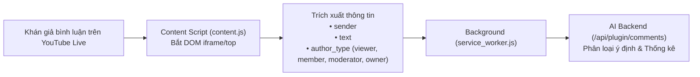

# Kế hoạch Triển khai YouTube Live AI Comment Collector Extension

Tài liệu kỹ thuật tinh gọn mô tả kiến trúc và cơ chế hoạt động của **Chrome Extension chạy ngầm (Headless - 0 UI, KHÔNG tự động trả lời)** chuyên thu thập, đồng bộ và phân tích bình luận thời gian thực từ livestream YouTube chuyển tiếp về AI Backend.

---

## 1. Mục tiêu & Nguyên lý Thiết kế
- **Hoàn toàn không có giao diện (Headless)**: Không popup, không overlay; chạy ngầm 100%.
- **Chế độ Chỉ Đọc (Read-only / No Auto-Reply)**: **Tuyệt đối KHÔNG tự động gõ hay gửi tin nhắn vào khung chat YouTube**, đảm bảo an toàn 100% cho kênh livestream và không gây phiền toái cho người xem.
- **Thu thập thời gian thực (Real-time Ingestion)**: Lắng nghe khung chat native của YouTube và trích xuất bình luận (`sender`, `text`, `author_type`, `timestamp`) đẩy về AI Backend để phân tích, phân loại câu hỏi và tổng hợp thống kê phiên live.

---

## 2. Kiến trúc & Luồng Xử lý



---

## 3. Cơ chế Kỹ thuật Then chốt

### 3.1. Hỗ trợ Iframe Chat (`all_frames: true`) & SPA Navigation
- YouTube Live nhúng khung chat trong iframe (`#chatframe` hoặc `/live_chat`).
- `manifest.json` cấu hình `"all_frames": true` giúp script bắt đúng document chứa danh sách chat.
- Lắng nghe `yt-navigate-finish` để tự động tái kết nối khi chuyển video mà không cần F5.

### 3.2. Bóc tách Bình luận Thời gian thực
- **Container**: `yt-live-chat-item-list-renderer #items`.
- **Selector tin nhắn**: `yt-live-chat-text-message-renderer`.
- **Thông tin trích xuất**:
  - `sender`: Tên khán giả (`#author-name`).
  - `text`: Nội dung chat (`#message`).
  - `author_type`: Phân loại huy hiệu (`owner`, `moderator`, `member`, `viewer`).
- **Khử trùng lặp (`seenIds`)**: Tránh thu thập lặp lại các tin nhắn cũ khi DOM re-render.

### 3.3. Đồng bộ Dữ liệu về AI Backend
Mỗi khi phát hiện bình luận mới, extension gửi qua `chrome.runtime.sendMessage`:
```javascript
chrome.runtime.sendMessage({
  type: 'NEW_COMMENT',
  payload: {
    id: "comment_id_123",
    sender: "nguyen_van_a",
    text: "Sản phẩm này bảo hành bao lâu shop?",
    author_type: "viewer",
    timestamp: 1728283849000
  }
});
```
Service worker chuyển tiếp dữ liệu tới AI Backend (`POST /api/plugin/comments`) để lưu trữ, phục vụ phân loại câu hỏi (`ai.operations`) hoặc gợi ý cho streamer trên bảng điều khiển.

---

## 4. Cấu trúc Thư mục

```text
extension/
├── manifest.json                  # Cấu hình Chrome Extension MV3 Headless
├── package.json                   # Metadata
└── src/
    ├── background/
    │   └── service_worker.js      # Gửi dữ liệu bình luận về AI Backend (/api/plugin/comments)
    └── content/
        └── content.js             # Lắng nghe DOM YouTube Live và thu thập bình luận (Read-only)
```

---

## 5. Hướng dẫn Chạy Thử Thực tế

1. **Nạp Extension**:
   - Vào `chrome://extensions/` $\rightarrow$ Bật **Developer mode** $\rightarrow$ Bấm nút Reload hoặc **Load unpacked** thư mục `extension/`.
2. **Mở Livestream YouTube**:
   - Mở một livestream YouTube bất kỳ có khung Live Chat (hoặc YouTube Studio).
   - Bấm `F12` $\rightarrow$ Tab **Console** sẽ hiển thị:
     `[YouTube Live AI] DA KET NOI TRUC TIEP vao khung chat YouTube Live! Dang lang nghe binh luan realtime.`
   - Khi có bất kỳ ai chat, Console sẽ in ra thông tin bình luận và gửi về AI Backend mà **hoàn toàn không can thiệp hay gửi tin nhắn gì vào khung chat**.
